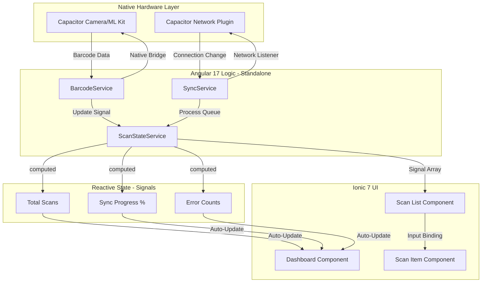

# ScanFlow Pro 🚀

**ScanFlow Pro** is an enterprise-grade warehouse inventory scanner built with **Ionic 7**, **Angular 17**, and **Capacitor**. It is designed to handle high-volume barcode scanning in environments with unstable network connectivity, featuring an intelligent offline-to-online synchronization engine.

## 🏗️ Technical Architecture

This project demonstrates a clean separation of concerns between native hardware bridges, reactive state management, and a modular UI layer.



## ✨ Key Features

* **Native Barcode Scanning:** Leverages `@capacitor-mlkit/barcode-scanning` for lightning-fast, hardware-accelerated detection.
* **Reactive State with Signals:** Uses Angular 17 Signals and `computed` values for a highly performant, boilerplate-free UI.
* **Offline-First Sync Engine:** Automatically queues scans during network outages and drains the queue once connectivity is restored via `@capacitor/network`.
* **Robust Error Handling:** Built-in logic to handle and display specific API error states (404 Item Not Found, 500 Server Error) with manual retry capabilities.
* **Modern Standalone Architecture:** 100% Standalone components and functional providers, eliminating the need for legacy NgModules.

## 🛠️ Tech Stack

* **Framework:** Ionic 7 + Angular 17 (Standalone)
* **Native Bridge:** Capacitor 5+
* **State:** Angular Signals & RxJS
* **Styling:** SCSS + Ionic Design System
* **CI/CD:** Vercel (PWA)

## 🚦 Getting Started

### Prerequisites

* Node.js v18+
* Ionic CLI (`npm install -g @ionic/cli`)
* Android Studio (for native testing)

### Installation

1. **Clone the repo:**

```bash
git clone https://github.com/SagarKhenat/scannerflow-pro.git
cd ScanFlowPro

```

1. **Install Dependencies:**

```bash
npm install

```

1. **Run in Browser (PWA Mode):**

```bash
ionic serve

```

1. **Run on Android:**

```bash
npx cap sync android
npx cap open android

```

## 📝 Portfolio Checklist Highlights

As part of my technical growth and documentation for the **weathertrack** and **ScanFlow Pro** projects:

* ✅ Implemented **Error State Logic** to improve user recovery from API failures.
* ✅ Integrated **Vercel CI/CD** with automated deployment triggers.
* ✅ Documented system architecture using **Mermaid.js** for technical clarity.

---
