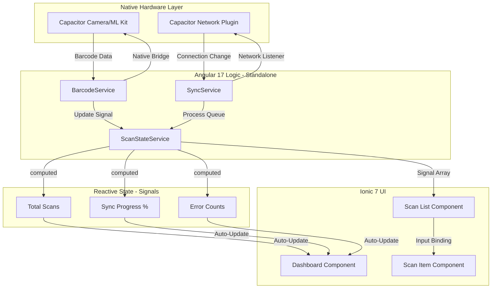

# ScanFlow Pro 🚀

**ScanFlow Pro** is an enterprise-grade warehouse inventory scanner built with **Ionic 7**, **Angular 17**, and **Capacitor**. It is designed to handle high-volume barcode scanning in environments with unstable network connectivity, featuring an intelligent offline-to-online synchronization engine.It features a state-of-the-art Signal-driven architecture designed for high-volume scanning and extreme reliability in professional environments

## 🏗️ Technical Architecture

This project demonstrates a clean separation of concerns between native hardware bridges, reactive state management, and a modular UI layer.



The application utilizes a reactive flow where UI states are computed results of raw data signals, ensuring a flicker-free and predictable user experience

## ✨ Key Features

* **Signal-Driven State Management:** Leverages Angular signals and computed values to manage complex UI states (loading, empty-fresh, empty-search, and data) with zero manual subscription management

* **Automated Data Persistence:** Features a reactive Auto-Save Engine using Angular effect() to automatically sync local state to Capacitor Preferences on every change

* **Native Barcode Scanning:** Leverages `@capacitor-mlkit/barcode-scanning` for lightning-fast, hardware-accelerated detection.

* **UX Resiliency:** Includes a Sync Timeout fail-safe and Skeleton Screens (ion-skeleton-text) to handle slow storage/network reads gracefully

* **Multi-Platform Export:** A unified bridge for CSV generation, supporting Capacitor Share for native mobile devices and Blob-streaming for web browsers

* **Robust Error Handling:** Built-in logic to handle and display specific API error states (404 Item Not Found, 500 Server Error) with manual retry capabilities.

* **Modern Standalone Architecture:** 100% Standalone components and functional providers, eliminating the need for legacy NgModules.

## 🛠️ Tech Stack

* **Framework:** Ionic 7 + Angular 17 (Standalone)
* **Native Bridge:** Capacitor 5+
* **State:** Angular Signals & RxJS (Modern Reactive Pattern)
* **Persistence:** Capacitor Preferences & Filesystem
* **Styling:** SCSS + Ionic Design System
* **CI/CD:** Vercel (PWA)

## 🧪 Testing & Verification

**1. Verifying Persistence**
To test the Auto-Save Engine, perform a scan and reload the app. The loadInitialData method will automatically hydrate the scanList signal from local storage.

**2. Mock Metadata Lookup**
The app includes a simulated lookupProduct method. To test:

Scan barcode 123456789 to see it transform into "Premium Coffee Beans".
Scan barcode 987654321 to see "Organic Almond Milk".

**3. Cross-Platform Export**
On Native Device: Clicking "Export" triggers the native share sheet via @capacitor/share.

On Web/PWA: Clicking "Export" triggers a direct .csv file download via a generated Blob.

## 🚦 Getting Started

### Prerequisites

* Node.js v18+
* Ionic CLI (`npm install -g @ionic/cli`)
* Android Studio (for native testing)

### Installation

1. **Clone the repo:**

```bash
git clone https://github.com/SagarKhenat/scannerflow-pro.git
cd ScanFlowPro

```

1. **Install Dependencies:**

```bash
npm install

```

1. **Run in Browser (PWA Mode):**

```bash
ionic serve

```

1. **Run on Android:**

```bash
npx cap sync android
npx cap open android

```

---
